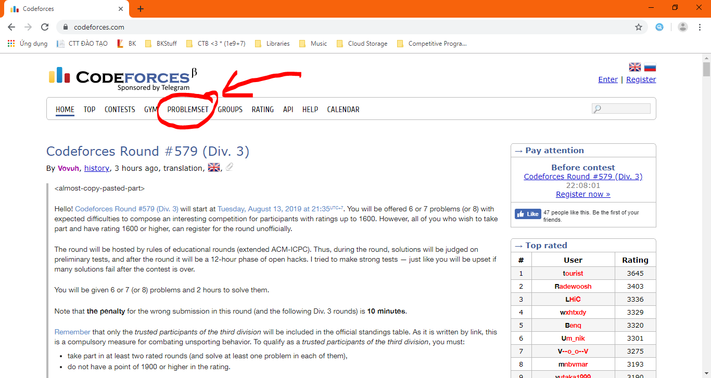
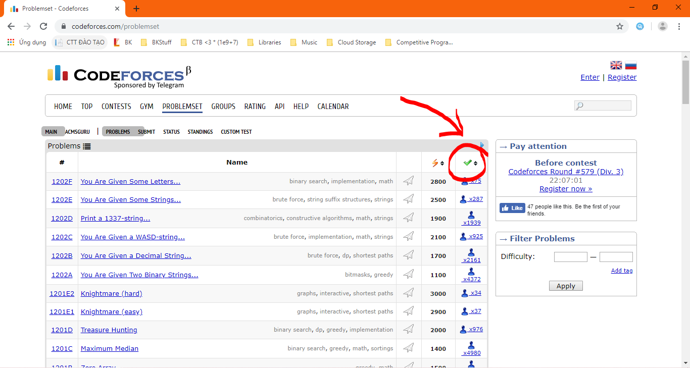

# KhU vỰc bEginNeR - Cho các bạn mới học :)))
Thông thường khi mới học Tin và CP, các bạn sẽ có câu hỏi là "học như thế nào, bắt đầu từ đâu, blah blah blah....". Vì vậy, thứ này ra đời và hy vọng rằng nó sẽ là một nguồn cho các bạn tham khảo và một phần nào đó trả lời câu hỏi trên :blush:

## 1. Các thuật ngữ các bạn sẽ phải làm quen
 * Thuật toán: [Wikipedia](https://vi.wikipedia.org/wiki/Thu%E1%BA%ADt_to%C3%A1n)
 * Lập trình: [Wikipedia](https://vi.wikipedia.org/wiki/L%E1%BA%ADp_tr%C3%ACnh_m%C3%A1y_t%C3%ADnh)
 * Lập trình thi đấu: [Wikipedia - tiếng Anh](https://en.wikipedia.org/wiki/Competitive_programming)
 
**Đọc hết:** Series lập trình thi đấu của [CowboyCoder](https://cowboycoder.tech):
 * [Phần 0](https://cowboycoder.tech/article/lap-trinh-thi-dau-co-ban-phan-1-gioi-thieu-ve-lap-trinh-thi-dau) - Phần 0: Giới thiệu về lập trình thi đấu
 * [Phần 1](https://cowboycoder.tech/article/lap-trinh-thi-dau-co-ban-phan-1-hoc-nhu-the-nao-de-thi-dau) - Phần 1: Học như thế nào để thi đấu?
 * [Phần 2](https://cowboycoder.tech/article/lap-trinh-thi-dau-co-ban-phan-2-giai-mot-bai-toan-nhu-the-nao) - Phần 2: Giải một bài toán như thế nào?
 * [Phần 3](https://cowboycoder.tech/article/lap-trinh-thi-dau-co-ban-phan-3-kiem-tra-va-soat-loi) - Phần 3: Kiểm tra và soát lỗi bài làm
 * [Phần 4](https://cowboycoder.tech/article/lap-trinh-thi-dau-co-ban-phan-cuoi-kinh-nghiem-khi-thi-cu) - Phần cuối: Kinh nghiệm khi thi cử
 
## 2. Những thứ cơ bản
 * Học tin học như thế nào? Xem ở series bài viết của anh Khánh trên VNOI Wiki: [Phần 1](http://vnoi.info/wiki/algo/basic/hoc-tin-the-nao-1) [Phần 2](http://vnoi.info/wiki/algo/basic/hoc-tin-the-nao-2)
 * Về giới thiệu về thuật toán và các lý thuyết về thuật toán, các bạn hãy đọc ở quyển 1 - Tài liệu giáo khoa chuyên tin
 * Về các ngôn ngữ lập trình: Nếu để đi thi, ngôn ngữ chính sẽ là C++. Các bạn cũng có thể tìm hiểu thêm JAVa, Python vì đây là những ngôn ngữ lập trình rất phổ dụng.
 
## 3. Giờ là phần về ngôn ngữ lập trình

### 3.1. C++

#### C++ là gì?
Xem tại Wikipedia :joy: 

#### Học C++ ở đâu?
Theo ý kiến cá nhân của mình, mình thường học ở đây: 
* http://cpp.daynhauhoc.com/
* https://vietjack.com/cplusplus/
* https://www.learncpp.com/

Để tham khảo các hàm, thư viện trong C++, các bạn vào đây: http://www.cplusplus.com/reference

### 3.2. Python và Java
_(coming soon)_

# 4. Let's get started - Bắt đầu thôi :relaxed:
_(các bạn phải code xong chương trình Hello World đã rồi mới đọc đến đây)_ 

Bây giờ là lúc các bạn luyện những bài đầu tiên để làm quen và "luyện tay". Mình khuyến khích các bạn làm những bài dễ nhất, làm càng nhanh càng tốt những bài này. Những bài này sẽ là các bài A và B trên Codeforces. Trước hết, các bạn tạo tài khoản Codeforces. Sau đó, để tìm bài, các bạn làm theo các bước sau:

#### B1: Ở trang chủ Codeforces, các bạn vào mục **Problemset** như trong hình

#### B2: Sau đó, trang web sẽ hiện lên một cái danh sách bài tập. Sau đó, bạn chỉ cần bấm vào cột cuối cùng bên phải

#### B3: Xong! các bạn đã có danh sách bài để luyện tập.
 
# 5. The Next Level
Phần hướng dẫn cho các bạn mới bắt đầu đã xong. Hy vọng sau bài này các bạn sẽ học được cái gì đó có ích cho mình. Và tất nhiên, đây cũng chỉ là ý kiến cá nhân của mình và có thể còn thiếu sót, mong mọi người góp ý để bài viết được chính xác và hữu ích hơn.

Thanks for reading.
